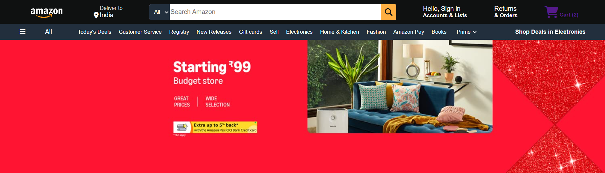
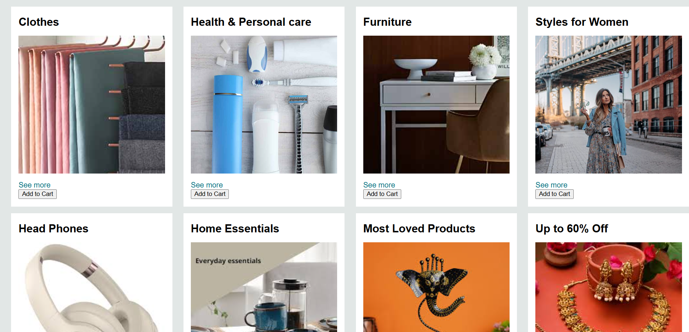
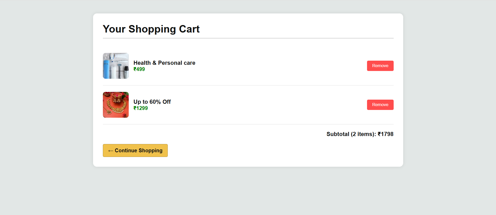

# 🛒 Amazon Clone - Frontend Project

This is a responsive Amazon Clone built using **HTML**, **CSS**, and **JavaScript**. The project mimics the look and feel of Amazon's homepage, includes shopping cart functionality, dynamic product rendering, theme toggling, and interactive UI elements.

---

## 🚀 Features

- ✅ Responsive Navbar with location, search, and cart icons  
- ✅ Product categories dynamically rendered using JavaScript  
- ✅ Add to Cart functionality with `localStorage`  
- ✅ Cart page with item images, pricing, subtotal, and remove buttons  
- ✅ Login modal with validation  
- ✅ Scroll to top and interactive elements  
- ✅ Mobile-friendly layout using Flexbox and Media Queries  

---

## 📸 Screenshots

### 🏠 Home Page

### 🛒 Cart Page

